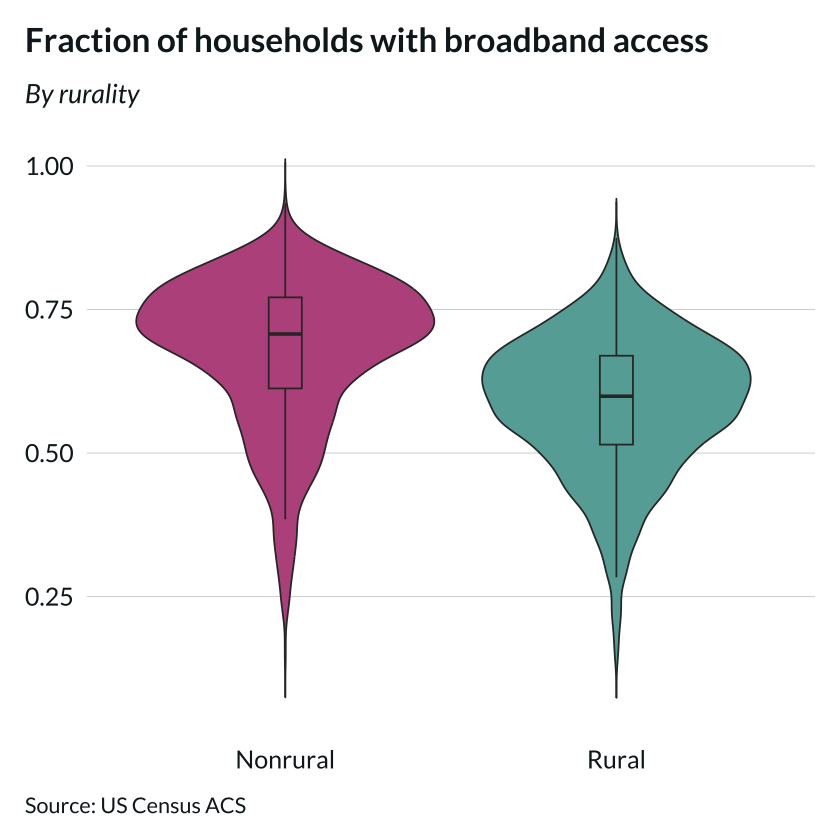
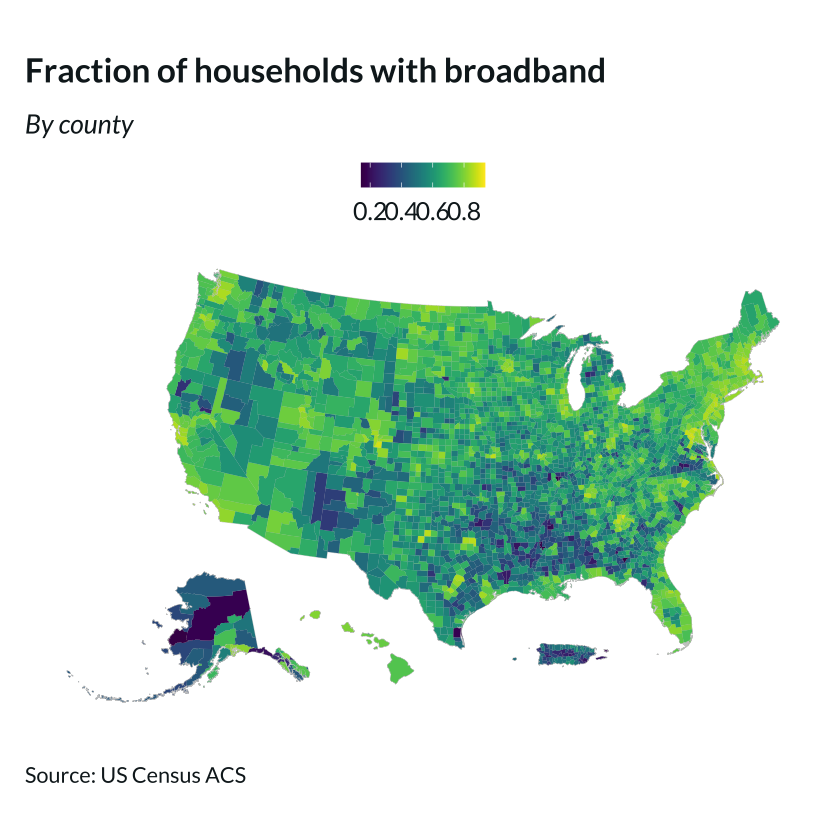

# Data visualization developer assessment - Ben Emery

```R
library(ggplot2)
library(tidycensus)
library(tidyverse)
library(tigris)
library(sf)
library(dplyr)
library(viridis)
options(tigris_use_cache = TRUE)
# Being a cybersecure person and importing my API key from an ignored file
census_api_key(readChar("api_key.txt",file.info("api_key.txt")$size))
```


```R
library(devtools)
# Bringing in the plotting style
devtools::install_github("ruralinnovation/cori.charts")
library(cori.charts)
cori.charts::load_fonts() 
```

## Importing and processing the data
The following cell has code that I commented out to avoid pulling from the internet too many times. I did this to mitigate connection issues, but I suppose it's also good request etiquette :).


```R
# Definitions of rural/nonrural can be fuzzy, we'll use CBSA
rural_defs <- read_csv("../data/cbsa_2020.csv")
rural_defs$GEOID = rural_defs$geoid # creating an uppercase for merging consistency
# B28002_007 = "Has a broadband internet subscription"
# B28002_001 = "Total households"
# "geometry = TRUE" pulls in the county shapes from tigris, allowing us to skip an additional merge.
# county <- get_acs(geography = "county", variables = c("B28002_001","B28002_007"), geometry = TRUE, year = 2023)

# county <- county %>% shift_geometry()
# county <- st_transform(county, crs=5070)
# st_write(county,'../data/counties-broadband-shape.shp',append=FALSE)
county <- st_read('../data/counties-broadband-shape.shp')
# county %>% filter(grepl('Conn', NAME))
```

    Reading layer `counties-broadband-shape' from data source 
      `/Users/benemery/cori/assessment/data/counties-broadband-shape.shp' 
      using driver `ESRI Shapefile'
    Simple feature collection with 6444 features and 5 fields
    Geometry type: MULTIPOLYGON
    Dimension:     XY
    Bounding box:  xmin: -3111747 ymin: -90959.31 xmax: 2258200 ymax: 3172568
    Projected CRS: NAD83 / Conus Albers


```R
# Loading multiple variables automatically formats them as long-form, creating multiple rows
# for each county. We pivot the data frame to wide-form so each county gets one row, and
# each variable has its own column.
county <- county %>%
  pivot_wider(names_from = variable, values_from = c(estimate,moe),values_fill = 0)


# Renaming columns for humans who don't memorize serial numbers.
colnames(county)[4] <- "households_est"
colnames(county)[5] <- "broadband_est"
colnames(county)[6] <- "households_moe"
colnames(county)[7] <- "broadband_moe"
# Create a new column that contains the amount of broadband access 
# expressed as a fraction of the total number of households.
county$broadband_frac = county$broadband_est/county$households_est


# The rural definitions seem to have Connecticut missing, so we'll need to rename the 
# merged df, and access the original later.
county_rurality <- merge(county, rural_defs[c('is_rural','GEOID')], by='GEOID')
```

## Generating plots
### 1. A simple plot comparing the two county categories


```R
# f<-ggplot(county, aes(is_rural,broadband_frac, fill=is_rural)) + #Uncomment to save figure
ggplot(county_rurality, aes(is_rural,broadband_frac, fill=is_rural)) +
    geom_violin(trim=FALSE)+
    geom_boxplot(width=0.1,outliers=FALSE)+
    theme_cori()+
    theme(legend.position="none")+
    scale_fill_cori(palette = "ctg2tlpu", reverse = TRUE)+
    labs(title = "Fraction of households with broadband access",
       subtitle = "By rurality",
       x = NULL,
       y = NULL,
       caption = "Source: US Census ACS")
# save_plot(f,"../export/broadband-violins.png",chart_width=6,chart_height=7,add_logo=FALSE) #Uncomment to save figure

```


    

    


As one would reasonably expect, rural counties, on average, have less broadband access. While the distributions do overlap substantially, it's notable that the rural median is close to the nonrural first quartile. The nonrural median fraction appears to by around 0.7, while the rural median fraction is closer to 0.6. By virtue of the distributional center being closer to the midpoint of the physical bounds, the rural distribution is closer to symmetric, while they both have some skew, with the longer tail extending into the lower values.

### A map of all the counties and their fractional broadband access
The following cell has all the lines commented out, because internet problems were preventing me from repeatedly running the `st_transform()` function. I instead exported the transformed shapefile after getting it to work and simply loaded it locally any time it was subsequently necessary.


```R
# The geometry is already there for us from the geometry = True tag earlier.

# But, we still need to rearrange the noncontiguous parts and specify the projection.
# county <- county %>% shift_geometry()
# county <- st_transform(county, crs=5070)
# st_write(county,'../data/counties-broadband-shape.shp',append=FALSE)
```


```R
# f <- ggplot(data=county)+
ggplot(data=county)+
      geom_sf(data = county, fill = NA, color = "gray80", size = 0.1) +
      geom_sf(
        data = filter(county), #is_rural == "Rural"), #If only plotting rural counties
        aes(fill = broadband_frac),
        color = NA
      ) +
    scale_fill_viridis(name = "fraction with access", na.value = "grey90") +
    labs(title = "Fraction of households with broadband",
        subtitle = "By county",
        caption = "Source: US Census ACS")+
    theme_cori_map()
# save_plot(f,"../export/broadband-2.png",chart_width=9,chart_height=7)
```


    

    


This is a rich visualization with more to be learned than I can process in this short time. The pieces that I notice will surely be a reflection of my personal and intellectual interests.

First, the northeast stands out as a region with anomalously extensive broadband access, especially in the band spanning from Massachusetts to DC. There's also a noticeable cluster of low access around Arkansas, Louisiana, Mississippi, and Alabama. Predictably, large portions of northern Alaska have virtually nonexistent broadband access. Access is also notably low in Puerto Rico, southern Virginia, the dividing line between Oregon/Idaho and California/Nevada, and around the Navajo Nation regions of Arizona and New Mexico. 


